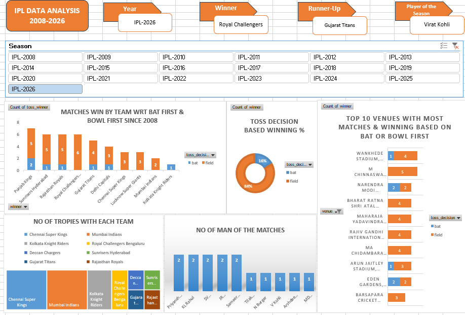

# IPL Data Analysis (Excel)

## 📊 Overview
This project analyzes IPL player data using Microsoft Excel. It includes data cleaning, visualization, and dashboard creation to uncover key insights.

## 🛠 Tools Used
- Microsoft Excel
- Pivot Tables
- Charts & Dashboard

## 📈 Key Insights
- Player distribution by batting and bowling styles
- Role-based analysis
- Data-driven patterns in IPL dataset

## 🖼 Dashboard Preview

